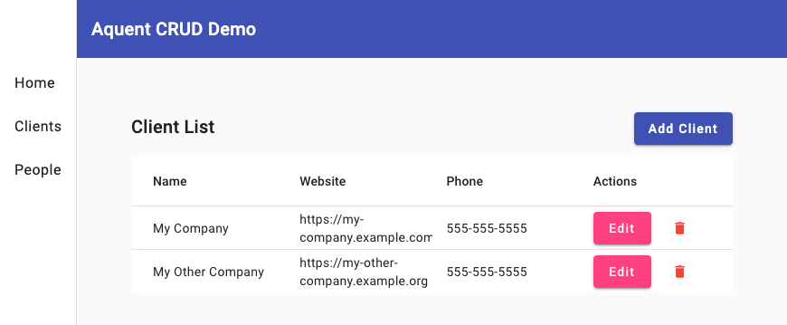
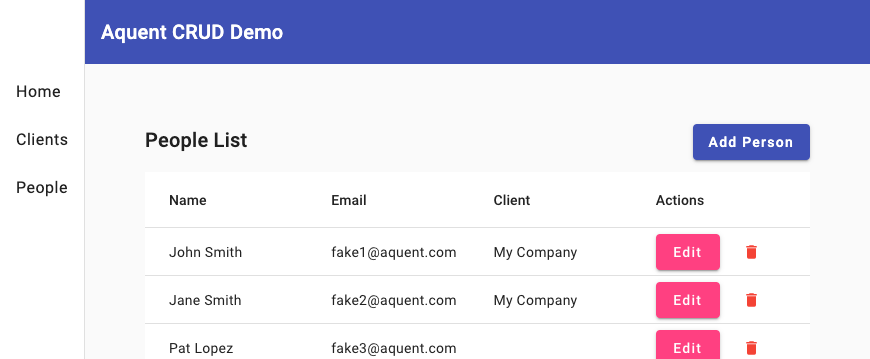
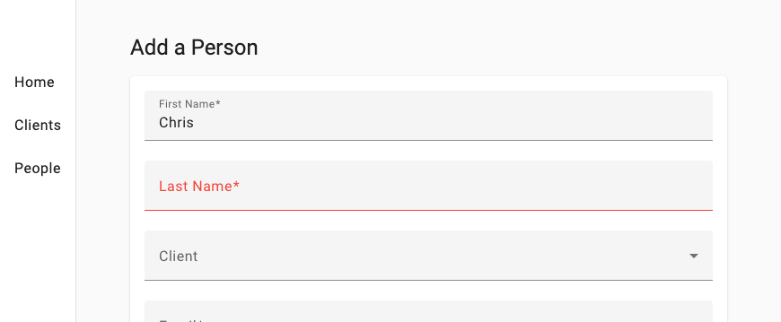

# Aquent developer candidate project

Hi! 👋 Thanks for checking out this simple CRUD app. If you stumbled here from some rouge Search Engine, please be aware this was a timeboxed, experimental project.

The instructions for this project (below) outlined a straightforward app, but I used this assignment as a opportunity to try new approaches. For instance, to minimize boilerplate code (and speed development), I used `spring-boot-starter-data-rest`. While this approach seemed promising initially, it may have baked me into corners I didn't have time to fully escape before my deadline 😁.

Overall, it was fun to branch out from my normal Python 🐍/React/REST world and give Angular, [Material UI](https://material.angular.io/), and HATEOAS a chance! If you have any questions or comments, please reach out 📞 — I'm friendly!

# Technologies

* Java 17
* Spring Boot
* HATEOAS
* Angular
* Material UI

# Screenshots





# Getting Started

## Run

```bash
# Backend
./mvnw spring-boot:run

# Frontend
cd frontend
npm install
ng serve

```

## Select API Examples

Visit the Angular Frontend at: http://localhost:4200/

```bash
# View a client
curl http://localhost:8081/api/v1/clients/1

# View a list of a client's contacts (people)
curl http://localhost:8081/api/v1/clients/1/contacts

# View a paginated list of people
curl http://localhost:8081/api/v1/people

# View a specific person
curl http://localhost:8081/api/v1/people/1
```

# Original Instructions below

You can find the code to use as the basis for this project at https://github.com/aquent/crud-app. Please fork the repo on GitHub and submit a link to your fork.

This is a Maven project. It is a simple CRUD web application known to work with Java 8. It uses Spring Boot with Thymeleaf views and Spring JDBC with an embedded database. The established features allow the user to manage a list of people with contact information.

Please implement the stories below to the best of your ability. Feel free to add features or technical improvements you feel are important or valuable as you see fit and have time. Be as creative as you want (even if that means using a completely different approach.) Feel free to correct our mistakes as well.

## Story #1

Add ability to manage clients (companies):

* The user should be able to create, edit, delete and list Clients.
* Clients should have a company name, website URI, phone number, and physical/mailing address.
* Clients can have zero, one, or multiple associated contacts.
* When editing a person, the user should be able to choose the associated client.
* When viewing a person, the associated client should be shown.
* When viewing a client, the associated contacts should be shown.
* When editing a client, the user should be able to add or remove associated contacts.

## Story #2

Add client­side styling and validation:

* Using your preferred javascript validation technique, prevent the submission on invalid data on the edit forms and inform the user of errors. The validations implemented on the front­end should be equivalent to the existing server side validation.
* Add standard styling to the pages using a modern CSS3/HTML5 framework like Twitter Bootstrap or Foundation (or similar).
